# Room For You - REST API

## Table of contents
* [Introduction](##Introduction)
* [Api endpoints documentation](##Api endpoints documentation)
* [Technology](##Technology)
* [External api used in application](##External api used in application)
* [How to start up an application](##HowToStartUpAnApplication)

## Introduction
### Room For You is a simple REST Api that has the capabilities to:
* Customer
    * create a customer,
    * update a customer,
    * delete a customer,
    * get data about customers.
* Apartment
    * create an apartment,
    * update an apartment,
    * delete an apartment,
    * get data about apartments, 
    * searching an apartment on its city and street,
    * obtaining information about the geographical coordinates of specific apartment (longitude and latitude),
    * getting weather information near specific apartment.
* Reservation
    * make a reservation,
    * update a reservation,
    * delete a reservation,
    * get data about reservations.

## Api endpoints documentation
* Customer endpoints
    * Get a list of all customers:
        * Http method - GET
        * Action : receive all customers data list
        * URL : http://mjakuszko.pl:8080/room/v1/customers
        * Sample of response:
        * 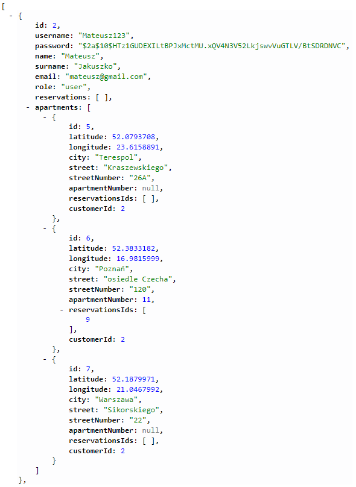
    * Get a customer by id
        * Http method - GET
        * Action : receive a customer data by id
        * URL : http://mjakuszko.pl:8080/room/v1/customers/{id}
        * Sample of response:
        * 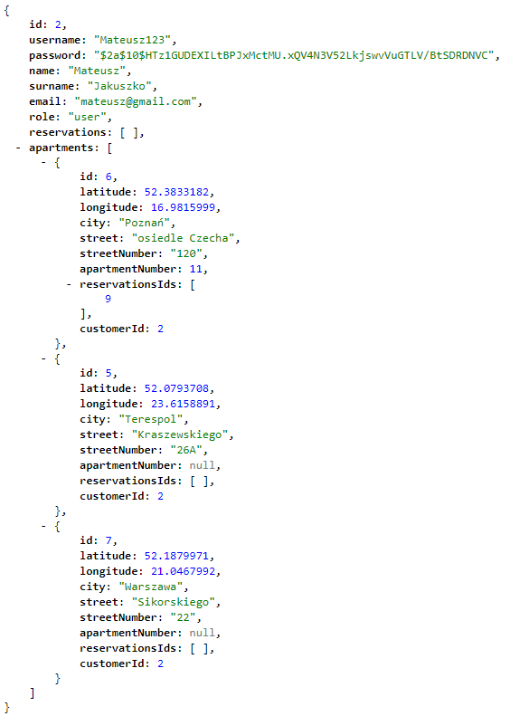
    * Create customer
        * Http method - POST
        * Action : create customer and save it into database
        * URL : http://mjakuszko.pl:8080/room/v1/customers/
        * Requirements : RequestBody
    * Update customer
        * Http method - PUT
        * Action : update customer
        * URL : http://mjakuszko.pl:8080/room/v1/customers/
        * Requirements : RequestBody
    * Delete customer by id
        * Http method - DELETE
        * Action - delete customer by id and save it into deleted elements database
        * URL : http://mjakuszko.pl:8080/room/v1/customers/{id}
        
* Reservation endpoints
    * Get a list of all reservations:
        * Http method - GET
        * Action : receive all reservations data list
        * URL : http://mjakuszko.pl:8080/room/v1/reservations
        * Sample of response:
        * 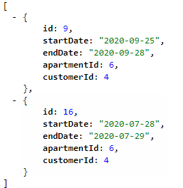
    * Get a reservation by id
        * Http method - GET
        * Action : receive a reservation data by id
        * URL : http://mjakuszko.pl:8080/room/v1/reservations/{id}
        * Sample of response:
        * 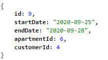
    * Create reservation
        * Http method - POST
        * Action : create reservation and save it into database
        * URL : http://mjakuszko.pl:8080/room/v1/reservations/
        * Requirements : RequestBody
    * Update reservation
        * Http method - PUT
        * Action : update reservation
        * URL : http://mjakuszko.pl:8080/room/v1/reservations/
        * Requirements : RequestBody
    * Delete reservation by id
        * Http method - DELETE
        * Action - delete reservation by id and save it into deleted elements database
        * URL : http://mjakuszko.pl:8080/room/v1/reservations/{id}
        
* Apartment endpoints
    * Get a list of all apartments:
        * Http method - GET
        * Action : receive all apartments data list
        * URL : http://mjakuszko.pl:8080/room/v1/apartments
        * Sample of response:
        * 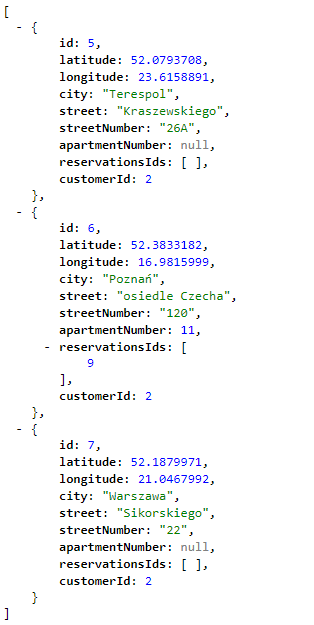
    * Get a apartment by id
        * Http method - GET
        * Action : receive a apartment data by id
        * URL : http://mjakuszko.pl:8080/room/v1/apartments/{id}
        * Sample of response:
        * 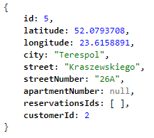
    * Create apartment
        * Http method - POST
        * Action : create apartment and save it into database
        * URL : http://mjakuszko.pl:8080/room/v1/apartments/
        * Requirements : RequestBody
    * Update apartment
        * Http method - PUT
        * Action : update apartment
        * URL : http://mjakuszko.pl:8080/room/v1/apartments/
        * Requirements : RequestBody
    * Delete apartment by id
        * Http method - DELETE
        * Action - delete apartment by id and save it into deleted elements database
        * URL : http://mjakuszko.pl:8080/room/v1/apartments/{id}
    * Get actual temperature near apartment by apartment id
        * Http method - GET
        * Action - receive actual temperature near apartment in Celsius degrees
        * URL : http://mjakuszko.pl:8080/room/v1/apartments/{id}/temperature
        * Sample of response:
        * 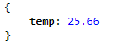
    * Get apartments by city and street name
        * Http method - GET
        * Action - receive a list of apartments witch specific city and street 
        * URL : http://mjakuszko.pl:8080/room/v1/apartments/search?city=cityParameter&street=streetParameter
        * Requirements : RequestParameters - street, city
        * Sample of response for http://mjakuszko.pl:8080/room/v1/apartments/search?city=Terespol&street=Kraszewskiego
        * 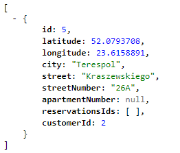
        
* Deleted Entities endpoints
    * Get deleted apartments
        * Http method - GET
        * Action - receive a deleted apartments
        * URL : http://mjakuszko.pl:8080/room/v1/deleted/apartments/
        * Sample of response:
        * 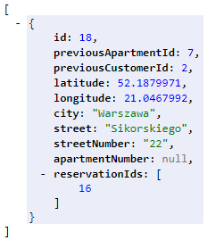
    * Get deleted reservations
        * Http method - GET
        * Action - receive a deleted reservations
        * URL : http://mjakuszko.pl:8080/room/v1/deleted/reservations/
        * Sample of response:
        * 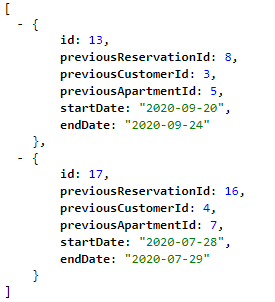
    * Get deleted customers - available for admin only
        * If You want to use this endpoint for tests u need to login as admin: 
            * username is "Admin" and password is "kodilla123"
        * Http method - GET
        * Action - receive a deleted customers
        * URL : http://mjakuszko.pl:8080/room/v1/deleted/customers/
        * Sample of response:
        * 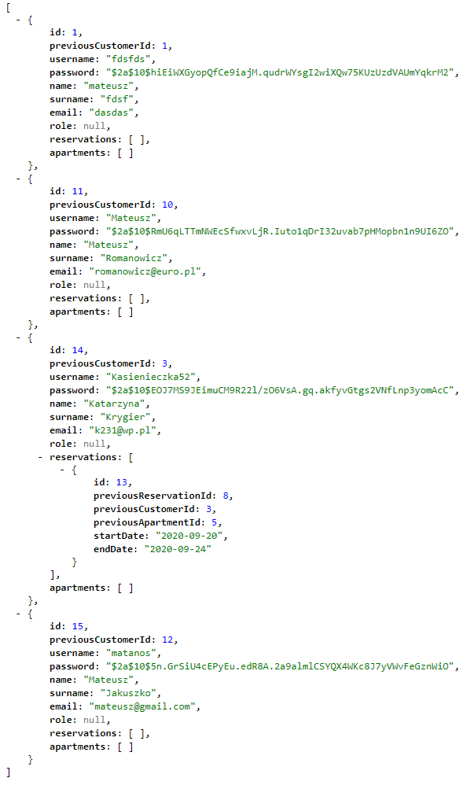
        
## Technology
- Java 8
- JUnit
- Gradle
- Spring
- SpringBoot
- Spring security
- H2 database
- PostgreSQL database (only in deployed application)

## External api used in application
- url : https://openweathermap.org/
- url : https://opencagedata.com/

## How to start up an application
* First option
    * application has been deployed on Tomcat server on my private VPS:
        * url to backend application: http://mjakuszko.pl:8080/room/
    * there is also very simple frontend application which has been deployed on the same sever, and it uses connection
    to Room For You api:
        * url to frontend application: http://mjakuszko.pl:8080/roomfront/
* Second option
    * download code from: 
        * https://github.com/SirVertar/room-for-you
        * server port: default
    * if you want frontend application You can download code from:
        * https://github.com/SirVertar/room-for-you-front
        * server port: 8070
    * run a backend application in IntelliJ IDEA or Eclipse
        * now u have available all endpoints which consist "Room For You" application 
    * run a frontend application. After a run it will be available on port 8070:
        * url : https://localhost:8070
